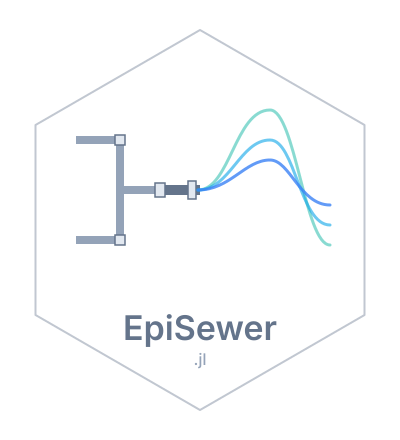

# episewer 

<!-- badges:start -->
| **Documentation** | **Build Status** | **Code Quality** | **License & DOI** | **Downloads** |
|:-----------------:|:----------------:|:----------------:|:-----------------:|:-------------:|
| [](https://seabbs.github.io/EpiSewer.jl/stable/) [](https://seabbs.github.io/EpiSewer.jl/dev/) | [](https://github.com/seabbs/EpiSewer.jl/actions/workflows/test.yaml) [](https://codecov.io/gh/seabbs/EpiSewer.jl) [](https://github.com/seabbs/EpiSewer.jl/actions/workflows/ad.yaml) | [](https://github.com/fredrikekre/Runic.jl) [](https://github.com/JuliaTesting/Aqua.jl) [](https://github.com/aviatesk/JET.jl) | [](https://opensource.org/licenses/MIT) | [](https://juliapkgstats.com/pkg/EpiSewer) [](https://juliapkgstats.com/pkg/EpiSewer) |

| ForwardDiff | ReverseDiff (tape) | ReverseDiff (compiled) | Enzyme forward | Enzyme reverse | Mooncake reverse | Mooncake forward |
|:---:|:---:|:---:|:---:|:---:|:---:|:---:|
| [](https://app.codecov.io/gh/seabbs/EpiSewer.jl?flags%5B0%5D=ad-forwarddiff) | [](https://app.codecov.io/gh/seabbs/EpiSewer.jl?flags%5B0%5D=ad-reversediff) | [](https://app.codecov.io/gh/seabbs/EpiSewer.jl?flags%5B0%5D=ad-reversediff-compiled) | [](https://app.codecov.io/gh/seabbs/EpiSewer.jl?flags%5B0%5D=ad-enzyme-forward) | [](https://app.codecov.io/gh/seabbs/EpiSewer.jl?flags%5B0%5D=ad-enzyme-reverse) | [](https://app.codecov.io/gh/seabbs/EpiSewer.jl?flags%5B0%5D=ad-mooncake-reverse) | [](https://app.codecov.io/gh/seabbs/EpiSewer.jl?flags%5B0%5D=ad-mooncake-forward) |
<!-- badges:end -->

EpiSewer.jl provides a Bayesian generative model to estimate the effective reproduction number R_t and other transmission indicators from pathogen concentrations measured in wastewater. This is a Julia implementation using composable components from the EpiAware.org ecosystem.

## About

The package replicates the modelling functionality of the EpiSewer R package by Adrian Lison. It estimates transmission dynamics from wastewater concentration measurements using MCMC sampling, with full uncertainty quantification.

## Derived from EpiSewer

This package is a Julia port of the [EpiSewer](https://github.com/adrian-lison/EpiSewer) R package by Adrian Lison and colleagues. The original model is described in:

> Lison, A., McLeod, R.E., Huisman, J.S. et al. Real-Time Estimation of Pathogen Transmission Dynamics from Wastewater. *Nature Communications* (2026). DOI: [10.1038/s41467-026-75380-3](https://doi.org/10.1038/s41467-026-75380-3)

This Julia version uses composable model components from the EpiAware.org ecosystem (`ComposableTuringIDModels.jl`, `CensoredDistributions.jl`, `EpiAwareADTools.jl`) rather than the Stan-based approach of the original.

## Model components

The model is composed of six modular components:

- **Measurements**: concentration observation model, noise estimation, limit-of-detection handling
- **Sampling**: outlier detection, sample batch effects
- **Sewage**: flow normalization, sewer residence time distributions
- **Shedding**: incubation period, shedding load distributions, load-per-case calibration, shedding variation
- **Infections**: generation time distribution, R_t estimation (GP, RW, splines), seeding, infection noise
- **Forecast**: probabilistic forecasts of R_t, infections, and concentrations

## Getting started

See the [documentation](https://seabbs.github.io/EpiSewer.jl/stable/) for a full walkthrough.

```julia
using EpiSewer
```

<!-- standard-sections:start -->
<!-- MANAGED by EpiAwarePackageTools.scaffold — do not edit between the
     markers. These standard sections are re-rendered on every update;
     edit the package-owned sections outside them, or CITATION.cff. -->

## Contributing

We welcome contributions and new contributors! Please open an issue or pull request on [GitHub](https://github.com/seabbs/EpiSewer.jl). This package follows [ColPrac](https://github.com/SciML/ColPrac) and is formatted with [Runic](https://github.com/fredrikekre/Runic.jl).

## How to cite

If you use EpiSewer in your work, please cite it. Citation metadata lives in [`CITATION.cff`](https://github.com/seabbs/EpiSewer.jl/blob/main/CITATION.cff), which GitHub renders as a "Cite this repository" button on the repository page.

## Code of conduct

Please note that the EpiSewer project is released with a [Contributor Code of Conduct](https://github.com/EpiAware/.github/blob/main/CODE_OF_CONDUCT.md). By contributing, you agree to abide by its terms.
<!-- standard-sections:end -->
