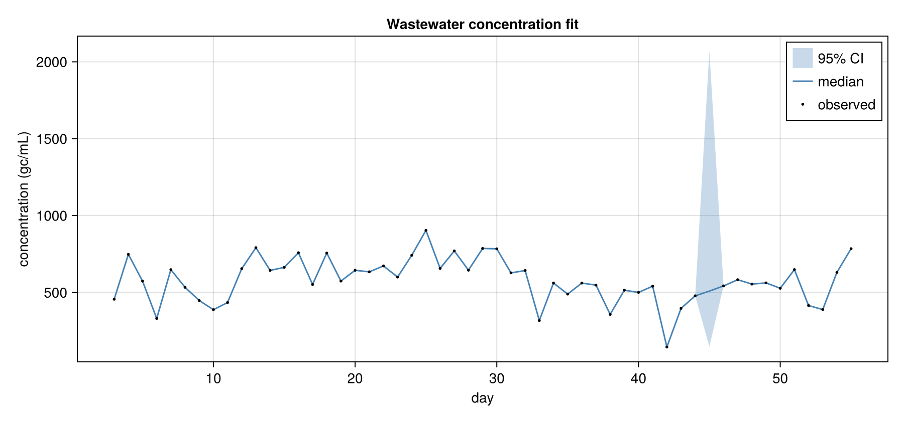
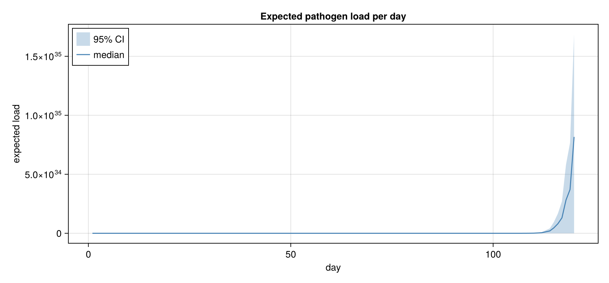
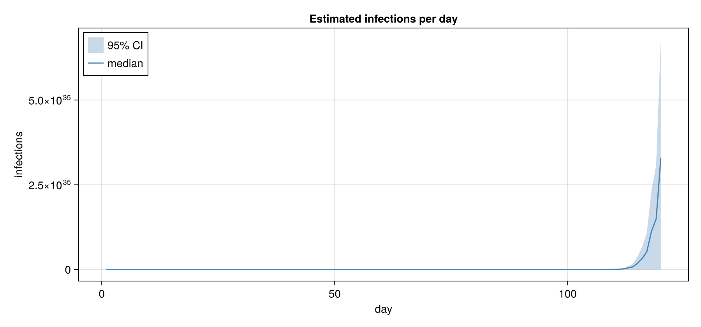

# EpiSewer.jl 

<!-- badges:start -->
| **Documentation** | **Build Status** | **Code Quality** | **License & DOI** | **Downloads** |
|:-----------------:|:----------------:|:----------------:|:-----------------:|:-------------:|
| [](https://epiaware.org/EpiSewer.jl/stable/) [](https://epiaware.org/EpiSewer.jl/dev/) | [](https://github.com/seabbs/EpiSewer.jl/actions/workflows/test.yaml) [](https://codecov.io/gh/seabbs/EpiSewer.jl) [](https://github.com/seabbs/EpiSewer.jl/actions/workflows/ad.yaml) | [](https://github.com/fredrikekre/Runic.jl) [](https://github.com/JuliaTesting/Aqua.jl) [](https://github.com/aviatesk/JET.jl) | [](https://opensource.org/licenses/MIT) | [](https://juliapkgstats.com/pkg/EpiSewer) [](https://juliapkgstats.com/pkg/EpiSewer) |

| ForwardDiff | ReverseDiff (tape) | ReverseDiff (compiled) | Enzyme forward | Enzyme reverse | Mooncake reverse | Mooncake forward |
|:---:|:---:|:---:|:---:|:---:|:---:|:---:|
| [](https://app.codecov.io/gh/seabbs/EpiSewer.jl?flags%5B0%5D=ad-forwarddiff) | [](https://app.codecov.io/gh/seabbs/EpiSewer.jl?flags%5B0%5D=ad-reversediff) | [](https://app.codecov.io/gh/seabbs/EpiSewer.jl?flags%5B0%5D=ad-reversediff-compiled) | [](https://app.codecov.io/gh/seabbs/EpiSewer.jl?flags%5B0%5D=ad-enzyme-forward) | [](https://app.codecov.io/gh/seabbs/EpiSewer.jl?flags%5B0%5D=ad-enzyme-reverse) | [](https://app.codecov.io/gh/seabbs/EpiSewer.jl?flags%5B0%5D=ad-mooncake-reverse) | [](https://app.codecov.io/gh/seabbs/EpiSewer.jl?flags%5B0%5D=ad-mooncake-forward) |
<!-- badges:end -->

EpiSewer.jl provides a Bayesian generative model to estimate the effective reproduction number R_t and other transmission indicators from pathogen concentrations measured in wastewater. This is a Julia implementation using composable components from the EpiAware.org ecosystem.

## About

The package replicates the modelling functionality of the EpiSewer R package by Adrian Lison. It estimates transmission dynamics from wastewater concentration measurements using MCMC sampling, with full uncertainty quantification.

## The model in words

This section walks through the model that EpiSewer.jl replicates, in plain language. A worked Julia example will follow once the components are implemented.

### Data

The model is driven by a time series of wastewater concentration measurements, ideally in gene copies per millilitre. Not every day needs a measurement: the model naturally accounts for missing or non-daily observations. Alongside the measurements, daily wastewater flow records are used to normalise the concentration signal for day-to-day variation in flow (for example due to rainfall). Optionally, confirmed case counts from the catchment area can be supplied; these calibrate the model so that the estimated number of infections roughly matches observed cases.

### From data to signal

Raw concentrations are first normalised by the daily flow, which removes much of the noise that a varying flow introduces into the raw signal. The normalised signal is then understood as a delayed and blurred trace of the infection process upstream: infected individuals begin to shed the pathogen some time after infection and continue to shed over a period of days, and the shed load is further blurred and delayed as it travels through the sewer network to the sampling site.

### Assumptions

To turn concentrations back into transmission dynamics we need a set of disease-specific distributions, typically taken from the literature: the generation time (the time between a primary infection and its secondary infections), the shedding load distribution (how much an average individual sheds over time), and, because the shedding load is usually expressed relative to symptom onset, the incubation period (the time between infection and symptom onset). All of these are discretised to a daily time step for use in the model.

### The latent model

Underlying the observations is a latent epidemic process. The number of new infections each day evolves according to a renewal process driven by a time-varying effective reproduction number, R_t. The reproduction number itself is allowed to vary smoothly over time, using a flexible smoothing model such as a Gaussian process or a random walk, so that we do not need to specify the trajectory in advance. The infection process also includes stochastic noise, capturing additional variability beyond what a deterministic renewal would imply.

### The observation model

The latent infections are mapped to an expected load by convolving the infection process with the shedding load distribution, and that expected load is in turn delayed through the sewer residence time before being divided by the flow to give an expected concentration. The observed concentrations are then modelled as this expected concentration corrupted by measurement noise. Together these pieces connect the observed wastewater concentrations to the hidden infection dynamics we want to estimate.

### Estimation

Combining the latent model and the observation model gives a full Bayesian generative model. Inference is performed with Hamiltonian MCMC sampling, which produces a full posterior distribution over every parameter. From that posterior we obtain R_t and the other transmission indicators — along with infections, expected load and concentration — together with credible intervals that quantify the uncertainty in every estimate.

> ✅ **A working composable model has been built.** The integration test at
> `test/integration_tests.jl` composes the EpiSewer components with core
> `ComposableTuringIDModels` pieces — `Renewal` (with a random-walk `R_t`),
> `Ascertainment` (per-case shed load), and `FlowNormalize` (flow-normalized
> observations over a `NormalError`) — into a single `@model` that fits the
> included example data. It is verified end-to-end with lightweight prior
> (predictive) sampling so the full pipeline composes cleanly.

## Derived from EpiSewer

This package is a Julia port of the [EpiSewer](https://github.com/adrian-lison/EpiSewer) R package by Adrian Lison and colleagues. The original model is described in:

> Lison, A., McLeod, R.E., Huisman, J.S. et al. Real-Time Estimation of Pathogen Transmission Dynamics from Wastewater. *Nature Communications* (2026). DOI: [10.1038/s41467-026-75380-3](https://doi.org/10.1038/s41467-026-75380-3)

This Julia version uses composable model components from the EpiAware.org ecosystem (`ComposableTuringIDModels.jl`, `CensoredDistributions.jl`, `EpiAwareADTools.jl`) rather than the Stan-based approach of the original.

## Model components

The model is composed of six modular components:

- **Measurements**: concentration observation model, noise estimation, limit-of-detection handling
- **Sampling**: outlier detection, sample batch effects
- **Sewage**: flow normalization, sewer residence time distributions
- **Shedding**: incubation period, shedding load distributions, load-per-case calibration, shedding variation
- **Infections**: generation time distribution, R_t estimation (GP, RW, splines), seeding, infection noise
- **Forecast**: probabilistic forecasts of R_t, infections, and concentrations

## Getting started

See the [documentation](https://seabbs.github.io/EpiSewer.jl/stable/) for a
full walkthrough.

The wastewater model is assembled as a composable
`ComposableTuringIDModels.IDModel` via the public (but not exported)
front end `EpiSewer.model(...)`. The default assembly replicates the EpiSewer
README example — a `Renewal` infection process with a random-walk `R_t`,
composed with the shedding delay, load-per-case scaling, flow normalization,
and observation noise — and can be evaluated on the example data directly:

```julia
using EpiSewer, ComposableTuringIDModels, Turing
import ComposableTuringIDModels: as_turing_model

# The example concentration column is already parsed to missing for unobserved
# days, so it loads as a Union{Missing,Float64} series. The series must be
# longer than the shedding-load PMF (>=9.0 days, the LatentDelay lower bound).
d = EpiSewer.example_data()
y = d.measurements.concentration            # 120 days of (gc/mL) concentrations
flow = Vector{Float64}(d.flows.flow)        # daily flow (mL/day) — data
mdl = EpiSewer.model()                      # returns an IDModel

# Flow is data: pass it through the observation-data contract at as_turing_model
# time (y = concentrations, flow = flow_vector), not as a model() argument.
mdl_t = as_turing_model(mdl, (y = y, flow = flow), length(y))
chn = sample(mdl_t, Prior(), 2)
```

`EpiSewer.model` is **public but not exported** (call it as
`EpiSewer.model(...)`, never `model(...)`), and its arguments are the
composable component structs (`infection_model`, `observation_model`, and the
`lpc_prior` parameterizing the default observation chain). The daily flow is
observed *data* and is passed through the observation-data contract at
`as_turing_model` time.

### Worked example: fit and plots

The full worked example (NUTS fit with 2 chains on 2 threads, then the
README plots) lives in [`examples/`](https://github.com/seabbs/EpiSewer.jl/tree/main/examples):

```sh
julia --project=docs --threads=2 examples/ww_fit_example.jl   # NUTS fit + diagnostics
julia --project=docs --threads=2 examples/ww_plots.jl         # R_t + prior-vs-posterior plots
```

Both scripts run in the docs environment: the package itself depends only on what
the model needs, so the inference-output and plotting packages the scripts use
(`MCMCChains`, `CairoMakie`, `PairPlots`) are declared in `docs/Project.toml`.

The fitted effective reproduction number `R_t` (reconstructed from the
renewal latent):


Prior (grey) vs posterior (blue) densities for the key scalar parameters:


The observed concentrations versus the model's posterior-predictive fit
(black: observed, blue band: 95% CI):



Posterior median and 95% CI for the expected pathogen load per day:



Posterior median and 95% CI for the estimated infections per day:



## Related packages

- [ComposableTuringIDModels.jl](https://github.com/EpiAware/ComposableTuringIDModels.jl): composable ID models built on Turing.
- [CensoredDistributions.jl](https://github.com/EpiAware/CensoredDistributions.jl): discretised and censored distributions for delay processes.
- [EpiAwareADTools.jl](https://github.com/EpiAware/EpiAwareADTools.jl): automatic-differentiation tooling for the EpiAware ecosystem.

## Documentation

Full documentation is hosted at [seabbs.github.io/EpiSewer.jl](https://seabbs.github.io/EpiSewer.jl/stable/), including the model-components table and a page recording the LLM-assisted development process.

<!-- standard-sections:start -->
<!-- MANAGED by EpiAwarePackageTools.scaffold — do not edit between the
     markers. These standard sections are re-rendered on every update;
     edit the package-owned sections outside them, or CITATION.cff. -->

## Contributing

We welcome contributions and new contributors! Please open an issue or pull request on [GitHub](https://github.com/seabbs/EpiSewer.jl). This package follows [ColPrac](https://github.com/SciML/ColPrac) and is formatted with [Runic](https://github.com/fredrikekre/Runic.jl).

## How to cite

If you use EpiSewer in your work, please cite it. Citation metadata lives in [`CITATION.cff`](https://github.com/seabbs/EpiSewer.jl/blob/main/CITATION.cff), which GitHub renders as a "Cite this repository" button on the repository page.

## Code of conduct

Please note that the EpiSewer project is released with a [Contributor Code of Conduct](https://github.com/EpiAware/.github/blob/main/CODE_OF_CONDUCT.md). By contributing, you agree to abide by its terms.
<!-- standard-sections:end -->
