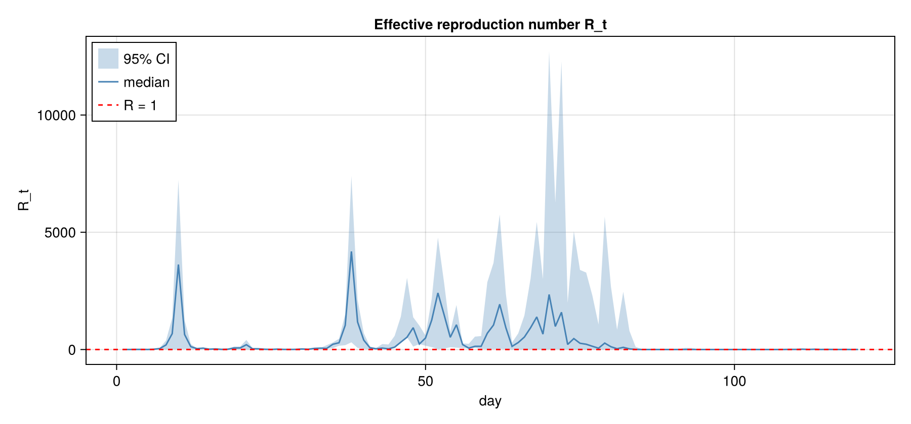
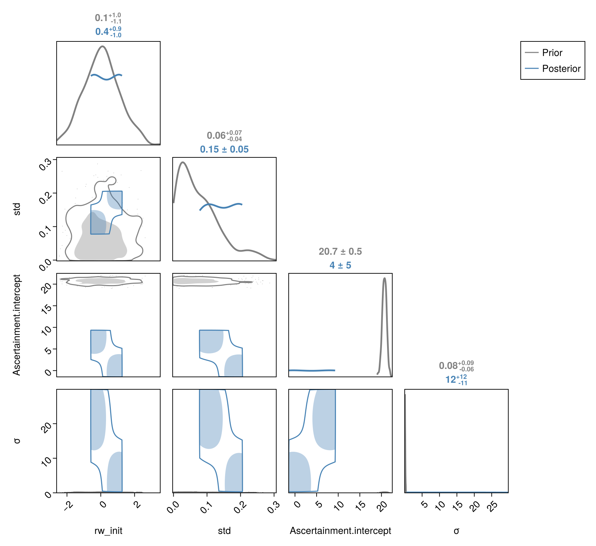

# [Getting started](@id getting-started)

Welcome to the `EpiSewer` documentation.
The home page is generated from the README and already carries the install and
model-overview prose, so start here with a first runnable example.

## A first example

The wastewater model is assembled as a composable
`ComposableTuringIDModels.IDModel` via the public (but not exported) front end
`EpiSewer.model(...)`. Evaluate it on the example data with `as_turing_model`
and sample from the prior:

```julia
using EpiSewer, ComposableTuringIDModels, Turing

# The example concentration column carries "NA" for unobserved days; the
# series must be longer than the shedding-load PMF (~38 days).
d = EpiSewer.example_data()
_parse_conc(v) = let s = string(v)
    (s == "NA" || s == "missing") ? missing : parse(Float64, s)
end
y = Vector{Union{Missing, Float64}}(_parse_conc.(d.measurements.concentration))
flow = Vector{Float64}(d.flows.flow)

mdl = EpiSewer.model(flow = flow)     # returns an IDModel
mdl_t = as_turing_model(mdl, y, length(y))
chn = sample(mdl_t, Prior(), 2)
```

## Worked example: fit and plots

Fit the model to the example data with NUTS (2 chains on 2 threads) and
reproduce the README plots:

```sh
julia --project=. --threads=2 examples/ww_fit_example.jl   # NUTS fit + diagnostics
julia --project=docs --threads=2 examples/ww_plots.jl      # R_t + prior-vs-posterior plots
```

The fitted effective reproduction number `R_t` (reconstructed from the
renewal latent):



Prior (grey) vs posterior (blue) densities for the key scalar parameters:



## Learning more

- Want the full interface? See the [Public API](@ref public-api).
- Want to report a problem or ask a question? Open an issue or start a
  discussion on the [GitHub repository](https://github.com/seabbs/EpiSewer.jl).

The layout, navigation, and infrastructure of this site are generated by
[EpiAwarePackageTools](https://epiawarepackagetools.epiaware.org).
Its docs cover customising the generated pages and how template sync keeps
this repository current.
